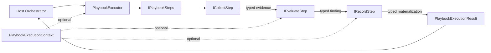
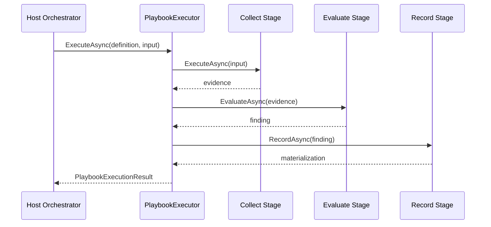

# Agents Playbook - Sprint 0 Context Diagram

## Sprint 0 Outcome
Sprint 0 captures the event flow and boundaries of the Goodtocode.Agents.Playbook CER execution engine.

## Context Boundary
The library is a host-independent execution boundary between an orchestrator and typed Collect, Evaluate, and Record implementations. It does not own model inference, persistence, transport, or governance policy storage.

## High-Level Context Diagram

## Event Storming Artifacts

### Commands
- DefinePlaybook
- ExecutePlaybook
- CollectEvidence
- EvaluateEvidence
- RecordFinding
- ExecuteWithContext
- CancelExecution

### Domain Events
- PlaybookExecutionStarted
- EvidenceCollected
- FindingEvaluated
- MaterializationRecorded
- PlaybookExecutionCompleted
- PlaybookExecutionCancelled
- EvidenceValidationCompleted

### Invariants Captured
- A definition is required before execution.
- Collect runs before Evaluate, and Evaluate runs before Record.
- Cancellation is checked before any stage begins and is forwarded to each stage.
- Context-aware Evaluate and Record stages receive the same explicit context.
- Execution metadata identifies the playbook and records start and completion timestamps.
- Policy evaluation validates evidence before applying policy.

## Sequence View

## Sprint 0 Decisions Reflected
1. The executor owns sequencing, not stage-specific business logic.
2. Stage contracts are generic and independent of transport or persistence.
3. Contextual behavior is opt-in and preserves the legacy stage contracts.
4. Cancellation is part of every stage contract.
5. The result is typed and contains execution metadata for the host.
