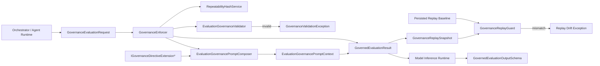
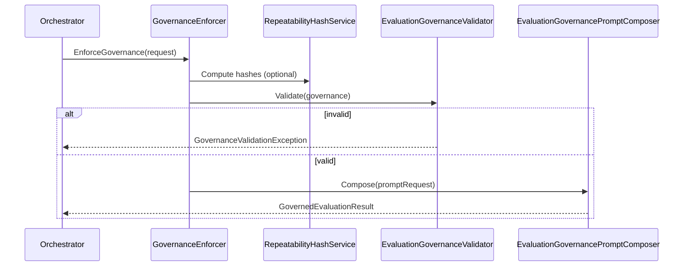

# Agent Governance - Sprint 0 Context Diagram

## Sprint 0 Outcome
Sprint 0 completed event storming and produced the context diagram for Goodtocode.Agents.Playbook in AI inference workflows.

## Context Boundary
The library is an enforcement boundary between caller orchestration and downstream model inference.

## High-Level Context Diagram

## Event Storming Artifacts

### Commands
- EnforceGovernance
- ComputeRepeatabilityHashes
- ValidateGovernanceRecord
- ComposeGovernedPrompt
- ApplyGovernanceExtension
- EnsureExactReplay
- ValidateGovernedOutput

### Domain Events
- GovernanceEvaluationRequested
- RepeatabilityHashComputed
- GovernanceValidationPassed
- GovernanceValidationFailed
- GovernancePromptComposed
- GovernanceExtensionApplied
- GovernanceReplayCompared
- GovernanceReplayDriftDetected
- GovernedEvaluationProduced
- GovernedOutputValidated

### Invariants Captured
- Governance must validate before prompt output.
- Confidence values remain in range 0..1.
- Extension directives cannot bypass governance behavior.
- Replay comparison is exact for policy/model/hash fields.

## Sequence View

## Sprint 0 Decisions Reflected
1. Enforcement is a mandatory pre-inference gateway.
2. Deterministic hashing + validation are first-class preconditions.
3. Prompt composition is deterministic and extension-safe.
4. Replay guard is explicit and separate from prompt composition.
5. Governed output contract is validated at domain boundary.
